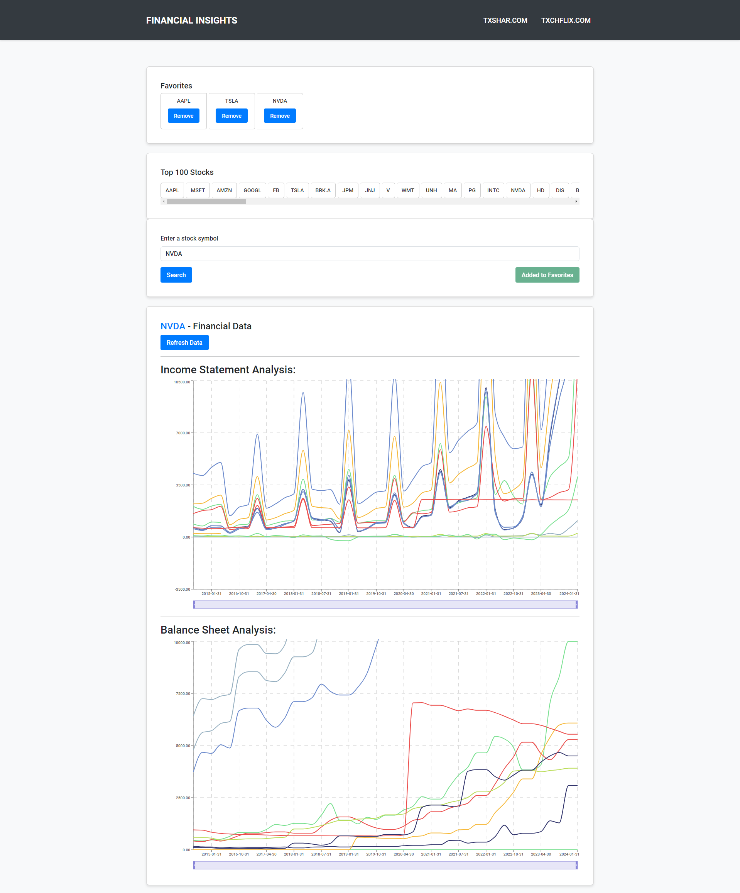
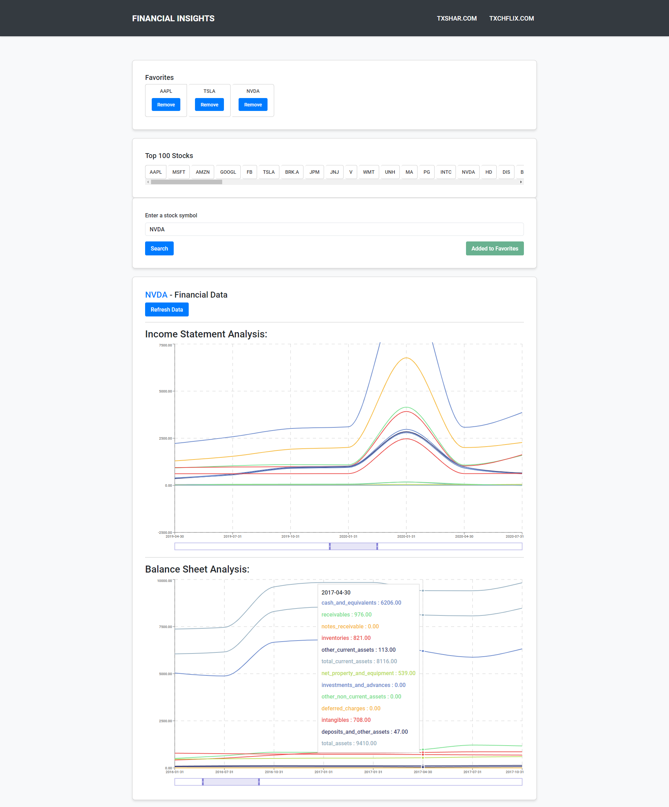
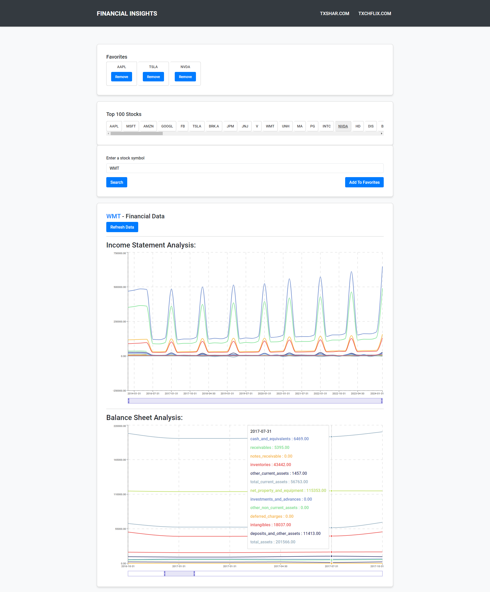

# Financial Insights - Stock Analysis React Application

Financial Insights is a user-friendly web application built with React that allows users to analyze financial data for various stocks. The application offers features such as searching stocks, viewing comprehensive financial data, and saving favorite stocks for quick access.

## Key Features

- **Stock Search**: Easily search for stocks using the stock symbol. The application supports the top 100 stocks, which simplifies the process of finding and analyzing popular stocks.
  
- **Financial Data Display**: Retrieve and display financial data, including balance sheet and income statement analysis. The data is presented in charts  for better visualization.
  
- **Data Sources**: Using the Alpha Vantage API as the primary data source for fetching financial data. In case of API rate limit issues or failures, seamlessly switch to the Dolt SQL endpoint as a fallback data source to ensure uninterrupted access to financial information.
  
- **Local Storage**: Improve performance and reduce unnecessary API calls by storing fetched financial data locally. Retrieve data from local storage for previously searched stocks, resulting in faster load times. Local Storage impact is very minimal.
  
- **Favorites**: Save favorite stocks for quick access. Add or remove stocks from the favorites list and easily navigate to the financial data of favorite stocks with a single click.
  
- **Responsive Design**: Enjoy optimal viewing and interaction across various devices and screen sizes with the application's responsive design. Access and analyze financial data seamlessly on desktops, tablets, and mobile devices.

## Detailed Technical Information

### Alpha Vantage API Integration
- The application integrates with the Alpha Vantage API to fetch real-time financial data for stocks.
- Axios is used for making HTTP requests to the Alpha Vantage API.
- Error handling mechanisms are implemented to switch to the Dolt SQL endpoint when API rate limits are reached or errors occur.

### Responsive Design
- React Bootstrap is used for building a responsive design, this gives an optimal user experience across different devices and screen sizes.
- Media queries and flexible layout components are utilized to achieve responsiveness and adaptability.

### Data Visualization
- Recharts, a charting library built with React and D3.js, is used for visualizing financial data.
- Dynamic chart generation based on fetched data allows users to gain insights into stock performance through interactive and visually appealing charts.

### Error Handling
- Error handling mechanisms are implemented to gracefully handle API request failures, invalid user inputs, and other potential errors.
- Error messages are displayed to users to provide feedback and guide them through the application.

### Dolt SQL Endpoint
- The application switches to the Dolt SQL endpoint as a fallback data source when the Alpha Vantage API rate limit is reached or errors occur.
- This ensures uninterrupted access to financial information, especially in scenarios where the free version of the Alpha Vantage API only allows a limited number of API calls (25 requests per day).

## Acknowledgements

- The Financial Insights project utilizes data from the [Alpha Vantage API](https://www.alphavantage.co/) and the [Dolt SQL endpoint](https://www.dolthub.com/).

## Contact

For inquiries or feedback regarding the Financial Insights project, please contact the project maintainer at [tas2124@gmail.com](mailto:tas2124@gmail.com).

## App Previews

